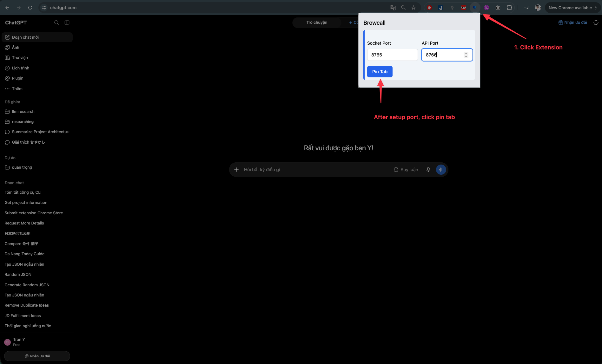
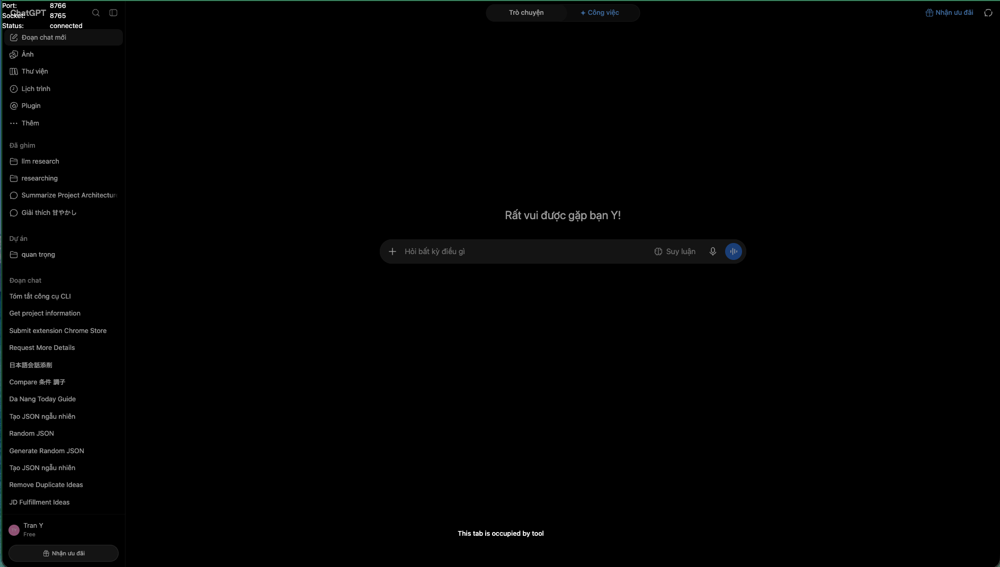

# Setup

This guide explains how to set up Browcall on your computer.

## 1. Install Browcall CLI

Install the Browcall CLI globally with npm:

```bash
npm install -g @ducy23061999/browcall-cli
```

Or with Yarn:

```bash
yarn global add @ducy23061999/browcall-cli
```

Verify the installation:

```bash
browcall --version
browcall --help
```

Start all Browcall services:

```bash
browcall start --all
```

This starts the Browcall services required for browser automation and MCP connections.

## 2. Install the Chrome Extension

Browcall uses a Chrome extension to connect browser automation with the Browcall backend.

### 2.1 Download the extension

[Download the Browcall Chrome Extension](https://drive.google.com/file/d/1M_Cy44NHj_YsUYs6LruZDk0aDKOlx4DA/view?usp=sharing)

1. Download the extension ZIP file.
2. Extract the ZIP file to a folder on your computer.
3. Open Chrome and go to:

```text
chrome://extensions
```

4. Enable **Developer mode**.
5. Click **Load unpacked**.
6. Select the extracted extension folder containing `manifest.json`.
7. Confirm that the Browcall extension appears in the extensions list.
8. Optionally, pin the extension to the Chrome toolbar.

> **Important:** Chrome must load the extracted folder, not the ZIP file itself.

### 2.2 Config connection

| Variable    | Description                   | Default |
| :---------- | :---------------------------- | :------ |
| `HTTP_PORT` | Port for the HTTP API         | `8766`  |
| `WS_PORT`   | Port for the WebSocket server | `8765`  |



After sucess, it's show



## 3. Install ngrok

ngrok is required when a Browcall service running on your computer needs to be accessed from outside your local machine.

### macOS

Install ngrok with Homebrew:

```bash
brew install ngrok
```

### Other operating systems

Download and install ngrok from the official ngrok website.

After installation, verify it:

```bash
ngrok version
```

### Configure your ngrok account

Add your ngrok authentication token:

```bash
ngrok config add-authtoken <YOUR_AUTH_TOKEN>
```

Replace `<YOUR_AUTH_TOKEN>` with the authentication token from your ngrok account.

## 4. Start an ngrok tunnel

By default, Browcall services run locally. To allow external services such as ChatGPT or Claude to interact with local MCP tools, expose the MCP Gateway through ngrok.

### MCP Gateway

The MCP Gateway uses port `8767`:

```bash
ngrok http 8767
```

Use the generated public URL with the MCP / SSE endpoint:

```text
https://<your-ngrok-domain>/mcp
```

```text
https://<your-ngrok-domain>/sse
```
