# Claude Code Inference

<video controls width="100%">
  <source src="_media/Demo Claude Code.mp4" type="video/mp4">
  Your browser does not support the video tag.
</video>

## 1. Start all components

Make sure you follow document [Setup](Setup.md?id=_1-install-browcall-cli)

## 2. Config Remote MCP Host

Quick access: [Chat GPT](#chat-gpt) | [Claude Web](#claude-web)

### Chat GPT

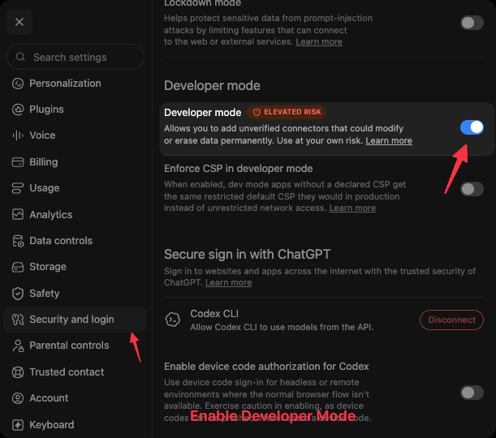

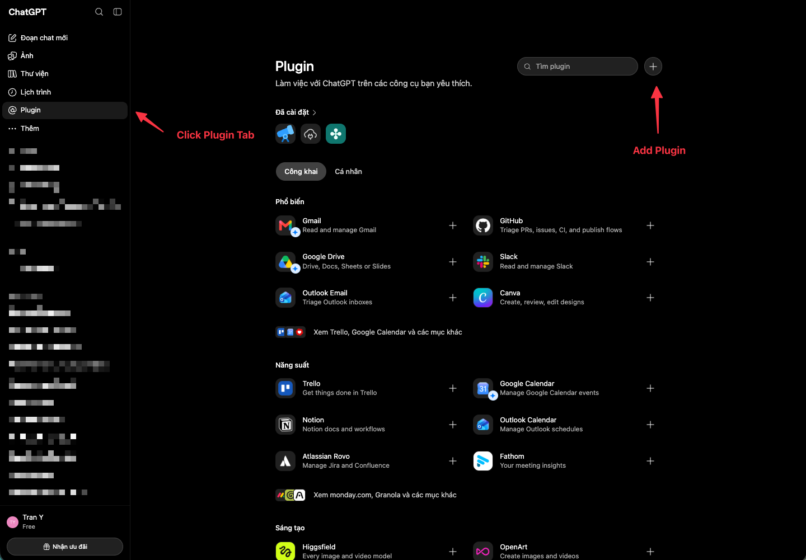

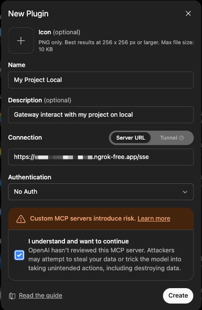

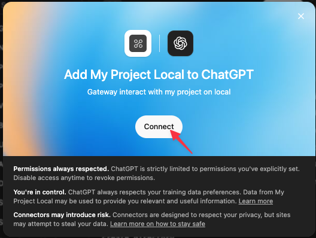

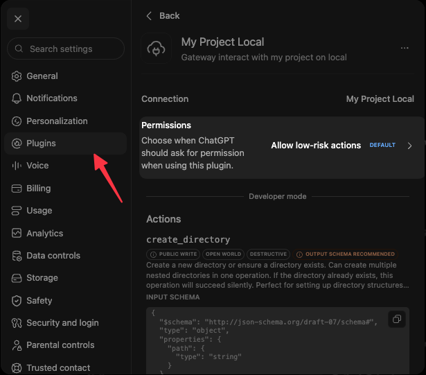

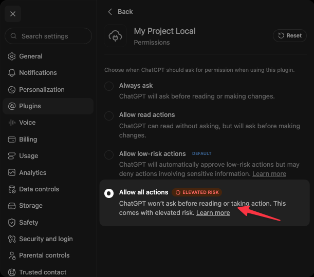

### Claude Web

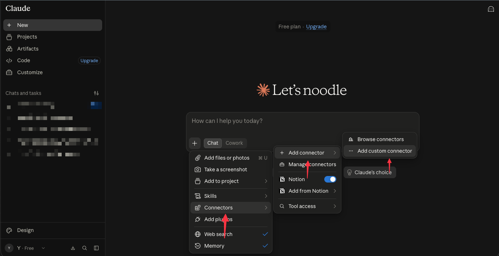

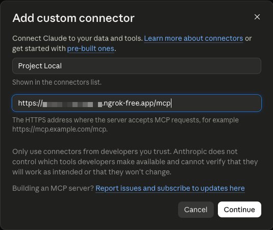

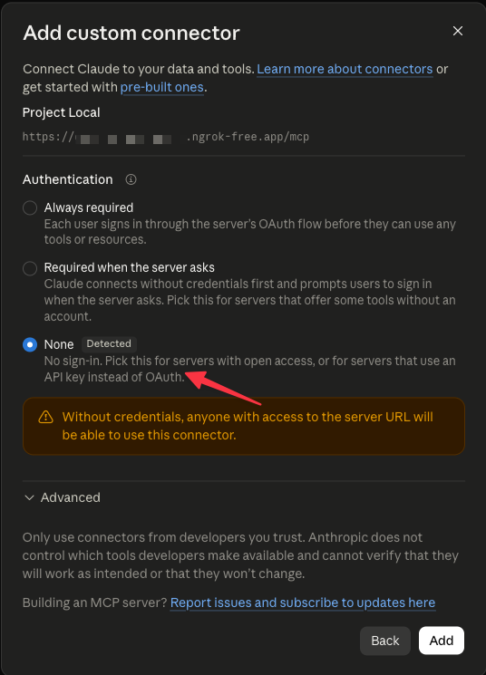

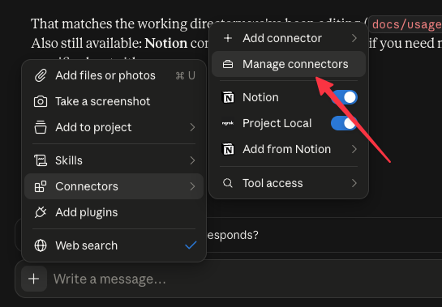

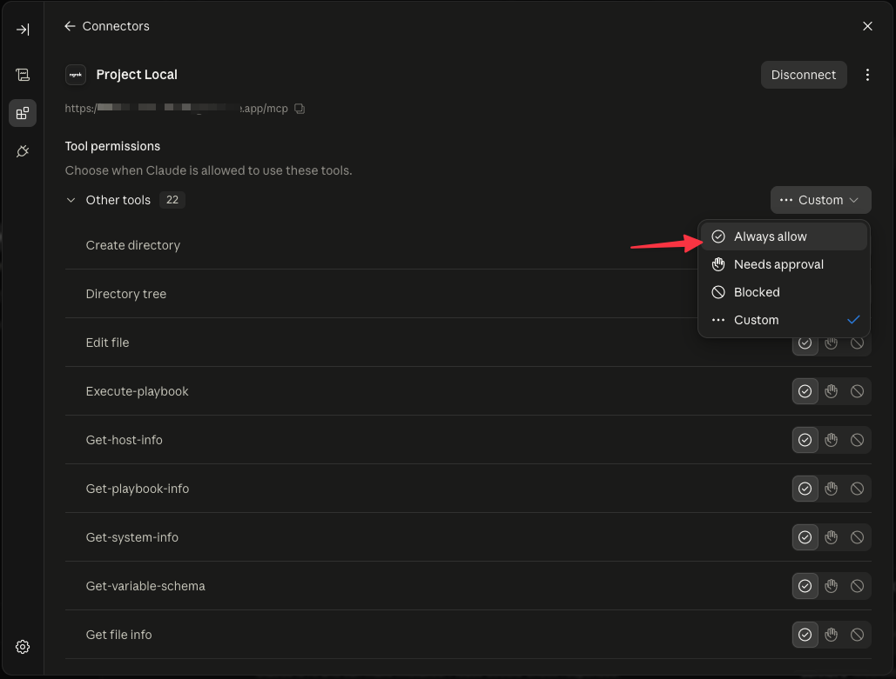

## 3. Configure Environment Variables

```bash
export ANTHROPIC_BASE_URL="http://localhost:8766"
export ANTHROPIC_API_KEY="dump-key"
```

## 4. Run Claude Code CLI

```bash
claude
```

All prompt completions and live rendering streaming deltas will now route through your browser extension session!
